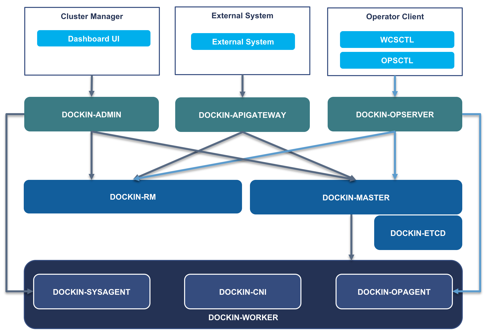

# Dockin Ops-Dockin Operation service

English | [中文](README.zh-CN.md)

Dockin container platform Operation service




## Quick Guide

### 1. Preparation
- k8s cluster
- Deploy Docking rm in advance, opserver needs to call rm interface to get information
- Prepare redis, you can quickly run redis with the following command:
```
docker run -p 6379:6379 -d redis:latest redis-server
```
- Plan to deploy opserver server, record the ip

### 2. Compile

#### 2.1 Dockin-opserver
- Modify the configuration file application.yaml, the main thing to note is the address of rm

```
rm-address: http://127.0.0.1:10002/rmController # RM access address
batch-timeout: 5000
http-port: 8084 # listening port of opserver
cmd-filter-type: blacklist
while-list-update-time: 60000
limits:
  exec-forbidden:
    -vi
  file-max-size: 1000
  upload-file-max-size: 500
  download-file-max-size: 4000
  vi-file-max-size: 10
  k8s-qos: 40
  k8s-burst: 60
opagent-port: 8085 # listening port of opagent
redis:
  expiration: 120000
accounts: # User information of opserver, currently configured in the configuration file
  -account:
      user-name: app
      passwd: passwd
```

- Compile: execute the following command

```
make
```

#### 2.2 Dockin-opsctl
- Modify opserver access address
```
# File to be modified: internal/common/url.go, change the constant RemoteHost to the ip and port corresponding to opserver
const RemoteHost = "127.0.0.1:8084"
```
- Compile: execute the make command
```
make
```


#### 2.3 Dockin-opagent
- Modify the configuration file application.yaml, the access address of rm should be noted
```
app:
  rm:
    api: http://127.0.0.1:10002/rmController # RM access address
  container:
    ticker: 30
  http:
    port: 8085
  debug:
    port: 10102
  ims:
    logroot: /data/logs/
  docker:
    sock: unix:///var/run/docker.sock
  qos:
    path: /data/cgroup
  logs:
    cmd-white-list:
      -grep
      -zgrep
      -cat
      -head
      -tail
      -awk
      -uniq
      -sort
      -ls
    cmd-timeout: 5000
    max-file-size: 3000
    max-line: 1000
    root: /data/logs/

```
- Compile and package opagent to docker image
```
make docker-build
```


### 3. Installation And Running

#### 3.1 dockin-opagent
1. Opagent runs in the k8s cluster as a daemonSet. You can directly refer to the daemonSet sample in the internal/docs directory of the project, modify the corresponding mirror information and apply it directly to the k8s cluster.

#### 3.2 dockin-opagent
1. Export the configuration file of the k8s cluster that needs to be managed, place it in the configs/cluster directory, and add a dockin section on the basis of the original configuration file. The example is shown below. Please see the corresponding notes for those who need attention:

```
apiVersion: v1
clusters:
-cluster: # The access address and name of the cluster can be declared multiple
    insecure-skip-tls-verify: true
    server: https://127.0.0.1:6443
  name: kubernetes
contexts: # Context information, mainly used to correspond to the above cluster information, set up some configurations
-context:
    cluster: kubernetes # cluster name, corresponding to the cluster name in the cluster section
    namespace: test # Use the namespace of the configuration operation
    user: kubernetes-readonly-user # The user used to access the cluster
  name: readonly-user
current-context: readonly-user # Context used by default
kind: Config
preferences: {}
users:
-name: kubernetes-readonly-user # User information, corresponding to the user in the context section
  user:
    password: your_password # User password
    username: readonly-user # username
dockin: # Additional custom configuration, the user declares the rules applicable to the cluster and the corresponding cluster id, and declares the default whitelist
  cluster-id: test
  rule: test
  whitelist:
    -127.0.0.1
```
2. Upload the *start.sh*, *configs* directories and compiled executable files in the project to the server, and execute the following commands:
```
sh start.sh
```


#### 3.3 dockin-opsctl
- Copy the executable file to the server to use it, use the following command to view the help:
```
dockin-opsctl -h
```

Currently, dockin-opsctl already supports the dockin-opserver address compiled by the configuration file. The path of other configuration files is: `$HOME/.opserver.yaml`. At the same time, it also supports the use of `-c` or `--config` parameters to prepare configuration files.
The configuration file uses a yaml file, and currently there is only one configuration:
```
Opserver: 127.0.0.1:8084
```